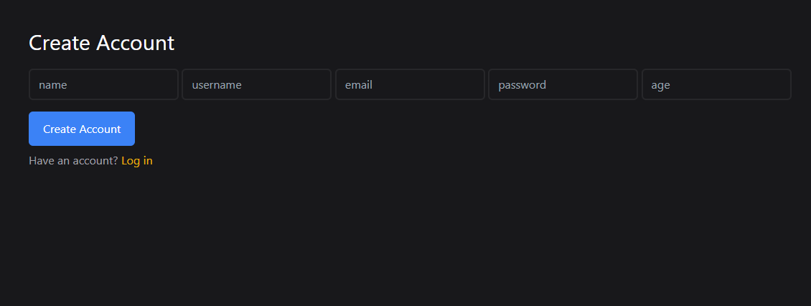
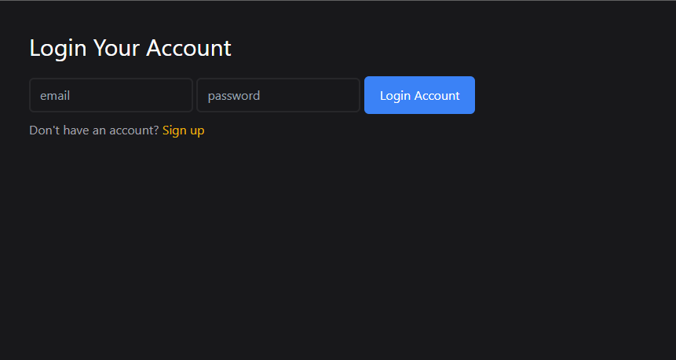

# SnapTrack

ExpressPost is a simple web app built with Express.js. It features user authentication, image uploads, profile management, and post interactions. Users can register, log in, upload profile pictures, create and edit posts, and like or unlike posts. The app follows standard CRUD (Create, Read, Update, Delete) operations for user profiles and posts.

## Features

- **User Authentication**: Secure registration and login using JWT.
- **Profile Management**: Upload and update profile pictures.
- **Post Creation**: Create, edit, and delete posts.
- **Post Interactions**: Like or unlike posts.
- **Image Upload**: Upload images with multer.
- **CRUD Operations**: Full support for Create, Read, Update, and Delete actions on user profiles and posts.

## Installation

1. Clone the repository:

    ```bash
    git clone https://github.com/ploosond/ExpressPost.git
    cd ExpressPost
    ```

2. Install the dependencies:

    ```bash
    npm install
    ```

3. Start the development server:

    ```bash
    npm start
    ```

    The server will start on `http://localhost:3000`.

## Usage

### 1. Registration



Register a new user by providing your name, username, email, password, and age.

### 2. Login



Log in with your credentials to access your profile and posts.

### 3. Profile Picture Upload


Upload or update your profile picture.

### 4. Profile


View your profile, including your posts and liked content.
